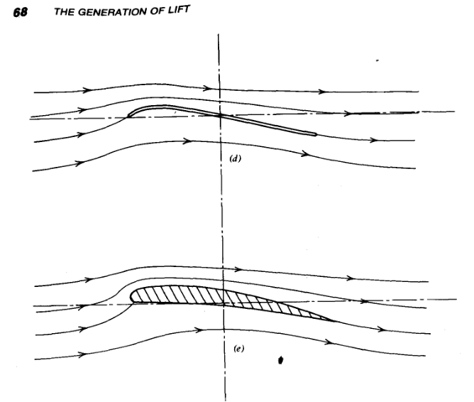
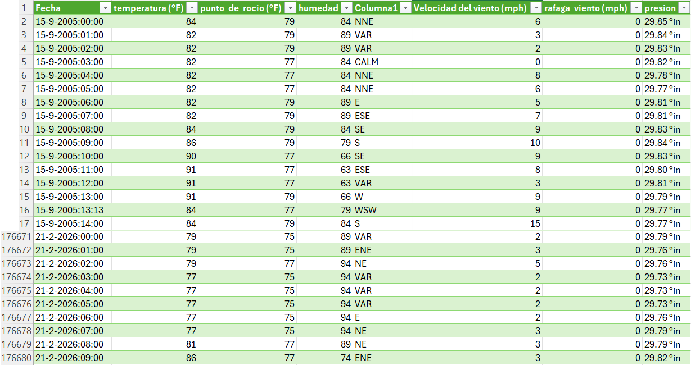
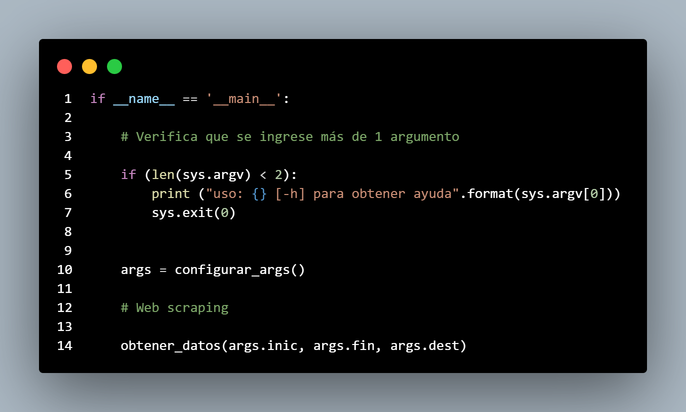

La física newtoniana clásica puede utilizarse para describir el comportamiento atmosférico. Es decir, los movimientos del aire obedecen a las leyes de la dinámica de Newton. El calor satisface las leyes de la termodinámica. La masa de aire y la humedad se conservan. Cuando se aplican a un fluido como el aire, estos procesos físicos describen la mecánica de fluidos.

La meteorología es el estudio de la mecánica de fluidos, la física y la química de la atmósfera terrestre.

Esta disciplina desempeña un papel fundamental en sectores como el aeroespacial, la ingeniería civil, la gestión medioambiental y la investigación climática. La meteorología es el puente entre la ciencia atmosférica pura y la resolución de problemas prácticos en el mundo real.

En el desarrollo de nuestra tecnología hacemos uso de datos meteorológicos para la caracterización precisa del entorno operativo. Variables como la presión atmosférica, la temperatura y la humedad relativa permiten calcular la densidad del aire en una zona específica mediante la ecuación de estado de los gases.

Las fuerzas resultantes que actúan en un perfil alar o sección aerodinámica pueden resolverse en un sistema de eje de vientos en términos de sustentación (L) y arrastre (D), tal como lo explica la teoría de ala finita:

  

$$
dL = \frac{1}{2} \rho V_e^{2}cC_ldr
$$

$$
dD = \frac{1}{2}\rho V_e^{2}cC_ddr
$$

Las fuerzas aerodinámicas que actúan sobre un cuerpo son directamente proporcionales a la presión dinámica en el flujo, que es la presión asociada a la energía cinética del fluido y se expresa como:

$$
q = \frac{1}{2}\rho V^2
$$

Pequeñas variaciones en la velocidad del viento generan cambios significativos en las cargas aerodinámicas experimentadas por la estructura. Estas cargas son fundamentales en el análisis de fatiga estructural bajo criterios acumulativos como la Regla de Miner, donde el daño depende directamente de la magnitud y frecuencia de los esfuerzos aplicados.

En el caso particular de ciudades tropicales como Cartagena de Indias, la alta temperatura y humedad reducen la densidad del aire frente a las condiciones estándar a nivel del mar. Una menor densidad del aire implica que los sistemas de propulsión deben demandar mayor potencia para generar el mismo empuje, afectando la eficiencia energética y el dimensionamiento de componentes.

Por tanto, desarrollamos un algoritmo capaz de extraer datos históricos de la estación del Aeropuerto Internacional Rafael Núñez (Cartagena de Indias), incluyendo 21 años de registros horarios desde el 15 de septiembre de 2005 hasta el 21 de febrero de 2026, con el propósito de diseñar soluciones tecnológicas fundamentadas en datos reales del entorno operativo.

  

## Obtención de datos metereológicos

Para el desarrollo del algoritmo de extracción se utilizó una técnica conocida como web scraping al sitio "https://www.wunderground.com/", este servicio nos proporciona información de variables como temperatura, punto de rocío, humedad relativa, dirección del viento, presión atmosférica y velocidad del viento.

  

El algoritmo fue desarrollado en Python utilizando Selenium WebDriver en modo automatizado. Permite la iteración jerárquica por año, mes, día y registro horario, exportando los datos en formato CSV para análisis estadístico y modelado ingenieril.

Aunque esta herramienta fue desarrollada inicialmente para aplicaciones aeronáuticas, su arquitectura es modular y adaptable a múltiples disciplinas.

Actualmente, estos datos están siendo utilizados en la Facultad de Ingeniería de la Universidad Tecnológica de Bolívar para investigaciones y desarrollos tecnológicos.

La herramienta es liberada para su uso, bajo la licencia de MIT permitiendo su aplicación en:

-   Ingeniería civil (cargas de viento y análisis estructural)
-   Estudios de corrosión y degradación de materiales
-   Energía eólica
-   Gestión ambiental
-   Planificación industrial basada en condiciones climáticas reales
-   Entre otras

En Olilienthal entendemos que el acceso estructurado a datos meteorológicos históricos es una herramienta fundamental para convertir la variabilidad atmosférica en criterio de diseño y desarrollo tecnológico.

### Referencias:
- https://eaglepubs.erau.edu/introductiontoaerospaceflightvehicles/chapter/airfoil-characteristics/
- McCormick, B. W., Aerodynamics, Aeronautics, and Flight Mechanics, 1979
- Meteorology for Scientists and Engineers, 3rd Edition
